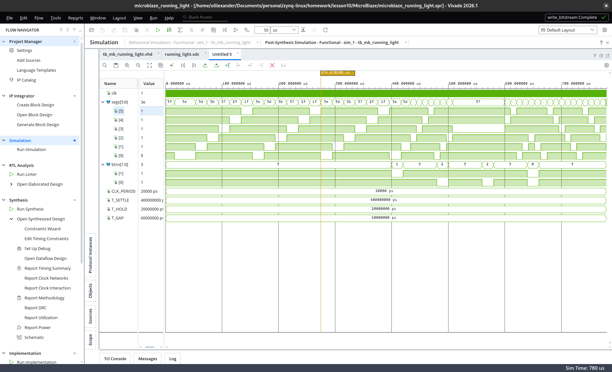
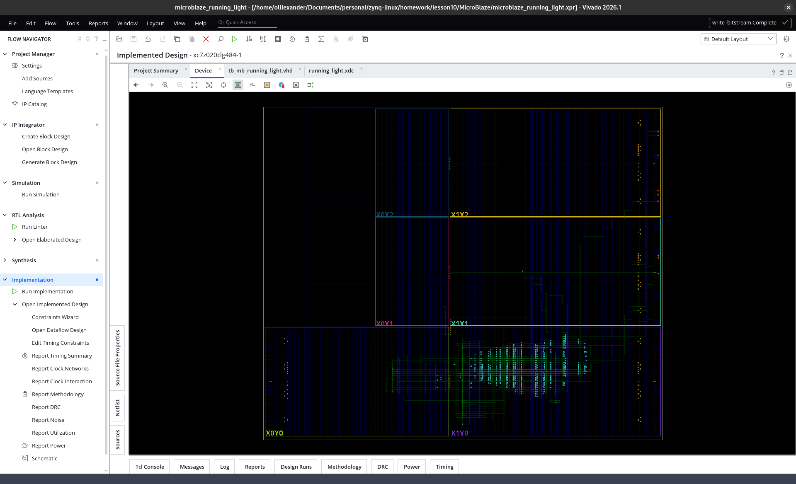

# Звіт — домашнє завдання після лекції 10

**Тема:** Zynq PS + AXI (біжуча доріжка), і MicroBlaze.
**Інструменти:** Vivado / Vitis 2026.1; block design + C (bare-metal).
**Плата:** Smart ZYNQ SL (XC7Z020-CLG484). Індикатор: один 7-сегментний,
**спільний анод**, зовнішні сегменти виведені на гребінку J5.

---

## Завдання 1. Zynq PS — біжуча доріжка

**Файли:** `PS-part/` — проєкт Vivado `running_light.xpr` (+ block design),
Vitis-проєкт `PS-part/vitis/` (platform + `app_component`), код `app_component/main.c`.

### Block design
- **ZYNQ7 PS** (FCLK_CLK0 у PL, M_AXI_GP0, IRQ_F2P);
- **AXI GPIO ×2:** `axi_gpio_0` — 6-біт **вихід** (сегменти кільця), `axi_gpio_1` — 2-біт **вхід** (кнопки);
- **AXI Timer** → переривання в `IRQ_F2P` (через GIC);
- AXI SmartConnect + Processor System Reset.

### Залізо / пін-план (J5, bank 35, LVCMOS33)
«Вогонь» біжить по **зовнішньому кільцю** індикатора — 6 сегментів a…f:
`H19, E18, F17, C17, G19, E20` (біти 0…5 `axi_gpio_0`).
Спільний анод → сегмент світиться при **0** (активно-низька логіка).
Кнопки — **бортові** K21/J20 (активно-низькі).

### Софт (C, bare-metal, на перериваннях)
- AXI Timer дає періодичне переривання **~10 мс** (не цикл-затримка — вимога виконана);
- в ISR «вогонь» реалізовано як **кільцевий зсув one-hot** регістра `pattern`
  (зсув уліво/вправо залежно від напряму), вивід інвертується під спільний
  анод: `ALL_OFF & ~pattern`;
- швидкість = кількість 10-мс тіків на крок (таблиця 500/200/80 мс);
- **K21** — коротке натискання: пауза/пуск; **J20** — перемикання швидкості;
- **обидві кнопки разом (акорд)** — зміна напряму; дебаунс і детект акорду — в ISR.

### Інженерні нотатки (розв'язані під час роботи)
- **SDT-flow BSP:** драйвери ідентифікуються за `BASEADDR`, не `DEVICE_ID`.
- **ID переривання GIC:** `XPAR_FABRIC_AXI_TIMER_0_INTR` дає **DT-номер SPI (29)**,
  а `XScuGic_Connect` хоче **абсолютний GIC-ID = SPI + 32 = 61** (`IRQ_F2P[0]`).
- **Лінк у OCM:** застосунок лінкується в `ps7_ram_0` (OCM, 0x0), а не в DDR —
  DDR-контролер під MT41K256M16 у дефолтному PS не налаштований, а для крихітного
  застосунку OCM (192 КБ) достатньо і DDR не потрібен.
- Завантаження/дебаг — у режимі **JTAG boot** (DIP).

### Результат
Перевірено на **реальному залізі**: один сегмент світиться і **біжить по колу**
всіма 6 сегментами кільця; кнопки керують паузою, швидкістю і напрямом.

---

## Завдання 2. MicroBlaze

Той самий функціонал, але замість Zynq PS — soft-ядро **MicroBlaze** у PL. Проєкт
`MicroBlaze/microblaze_running_light.xpr`, застосунок `MicroBlaze/app_component/`,
тестбенч `MicroBlaze/sim/tb_mb_running_light.vhd`.

### Block design
- **MicroBlaze** + **LMB BRAM 64 КБ** + **MDM**;
- **Clocking Wizard**: вхід **50 МГц** (осцилятор PL на **M19**, single-ended) → 100 МГц;
- **Proc System Reset**: `ext_reset_in` притягнутий `xlconstant` (окремої кнопки reset на платі нема), power-on reset від `locked` MMCM;
- **AXI GPIO ×2** (6-біт вихід сегменти, 2-біт вхід кнопки), **AXI Timer**;
- **AXI INTC замість GIC**: `axi_timer.interrupt → xlconcat → axi_intc.intr`, `axi_intc.irq → microblaze.INTERRUPT` (у MicroBlaze один вхід переривання, векторизацію робить INTC).

Пін-план — як у Завданні 1 (`MicroBlaze/running_light.xdc`), плюс клок `M19` (50 МГц, 20 нс).

### Софт (C)
Логіка та сама, відмінність — контролер переривань: **`XIntc`** замість `XScuGic`,
обробник через `Xil_ExceptionRegisterHandler(XIL_EXCEPTION_ID_INT, …)`, ID переривання
= `XPAR_FABRIC_AXI_TIMER_0_INTR` (**без зсуву +32**, на відміну від GIC). Для симуляції
`TIMER_RELOAD` навмисно малий: крок «вогню» настає вже за мікросекунди модельного часу
симуляції, інакше на один крок довелося б проганяти ~10 мс віртуального часу (мільйони тактів).

### Тестбенч
`tb_mb_running_light.vhd` драйвить `clk` (50 МГц) і кнопки (активно-низькі): пауза
`T_SETTLE`, далі **KEY2** (швидкість) → **KEY1** (пауза) → **KEY1** (пуск) → **акорд**
(зміна напряму). `.elf` збирається у Vitis і асоціюється з `microblaze_0`.

### Баг потоку Vivado/Vitis 2026.1 і як його обійшли
**Симптом:** у **behavioral**-симуляції реальний `.elf` не завантажувався в BRAM —
програма не виконувалась, вихід GPIO стояв на дефолті `C_DOUT_DEFAULT=0x3F` (усі сегменти
off). При цьому `.mem` із програмою генерувався коректно, а `clk_wiz.locked=1`.

**Причина (специфіка інструмента):** модель BRAM (`blk_mem_gen`), яку компілює
behavioral-симуляція, — **VHDL-нетліст**, і завантаження init-файлу гейтиться генериком
**`C_LOAD_INIT_FILE`**, який автопотік асоціації ELF **не вмикає**; сам IP **зашифрований**,
тож пропатчити не можна. Verilog-модель того самого IP вантажить `.mem` безумовно, але при
**Simulator language = Mixed** VHDL-батько `microblaze_0_local_memory` усе одно привʼязує
**VHDL**-дитину. Тобто це нерівність VHDL/Verilog моделей чужого IP (екосистема Xilinx —
Verilog-first) + непрацюючий авто-init через кастомний тестбенч.

**Обхід:** **Post-Synthesis Functional Simulation** — памʼять береться з синтезованого
нетлісту, куди `.elf` запікається через `updatemem`, від VHDL-моделі не залежить.
Тестбенч і сигнали ті самі.

У результаті MicroBlaze виконує реальний `.elf`: `segs` циклить по кільцю
(`3f→3e→3d→3b→37→2f→1f…`), а натискання кнопок змінюють швидкість, паузу і напрям.

### Результат на залізі
Дизайн зібрано до бітстріму (`write_bitstream Complete`) і перевірено на платі.

