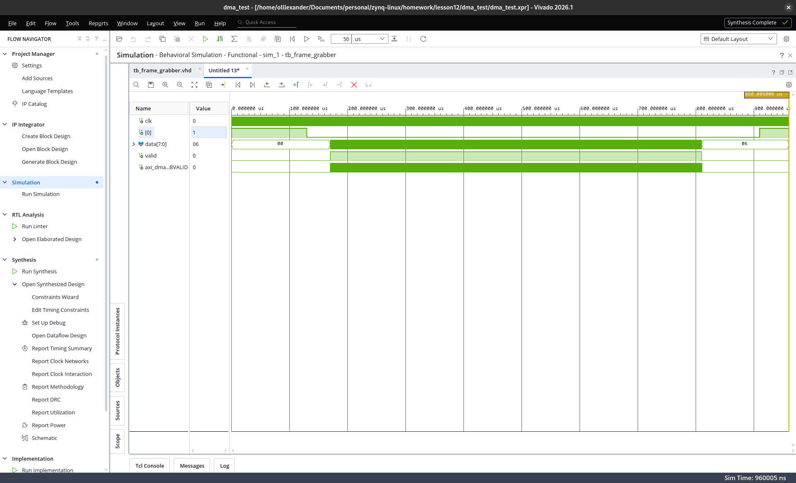
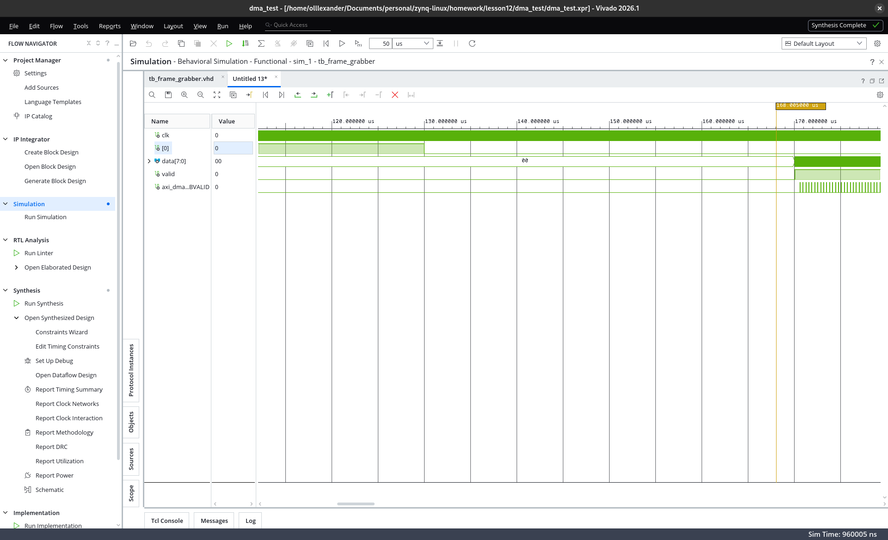
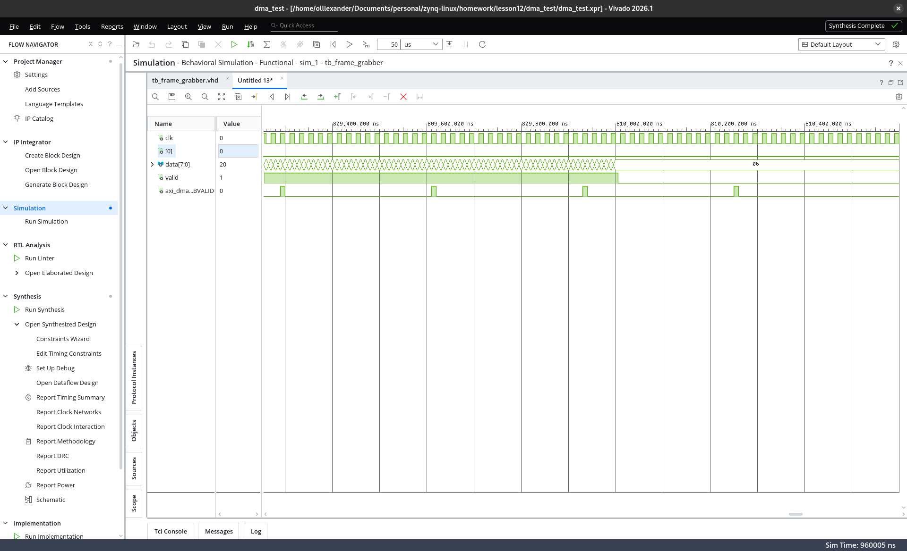

# Звіт — домашнє завдання після лекції 12

**Тема:** Frame grabber на MicroBlaze — прийом зовнішнього 8-бітного потоку, пакування
у 32-бітні слова, запис цілого кадру 320×200 через AXI DMA у `axi4_full_ram`; старт
прийому з кнопки через AXI GPIO.
**Інструменти:** Vivado / Vitis 2026.1; block design + C (bare-metal); власний VHDL-модуль + testbench.
**Плата:** Smart ZYNQ SL (XC7Z020-CLG484). Завдання **суто симуляційне** — джерело кадру абстраговане у тестбенчі.

---

## Розрахунок об'єму пам'яті

- Кадр 320 × 200 = **64000 байт** = 64000 / 4 = **16000** 32-бітних слів.
- RAM під цілий кадр — **64 КіБ** (`blk_mem_gen` `ADDR_WIDTH=16`, 16384×32 = 65536 байт).
- Відповідно: модуль `FRAME_WORDS = 16000`, прошивка `FRAME_BYTES = 320*200`, трансфер DMA `S2MM_LENGTH = 64000`.

---

## Block design (`dma_test_design`)

- **MicroBlaze** + **LMB BRAM 64 КБ** + **MDM**;
- **Clocking Wizard:** вхід **50 МГц** (осцилятор PL на **M19**) → **100 МГц** системний такт;
- **Proc System Reset:** `ext_reset_in` притягнутий `xlconstant`, power-on від `locked` MMCM;
- **AXI GPIO** (`axi_gpio_1`, 1 біт, all-inputs) — кнопка KEY1 (активно-низька);
- **`axis_frame_rx`** (власний модуль) → **AXI DMA** (`axi_dma_0`, лише S2MM, simple mode) → **AXI BRAM Controller** + `blk_mem_gen` (64 КБ, `axi4_full_ram` @ `0xC0000000`);
- **AXI SmartConnect** між S2MM-майстром DMA і BRAM-контролером.

**Потік даних:** `rx_data[7:0]`+`rx_valid` → `axis_frame_rx` (FIFO + пакування 4→32) → `M_AXIS` → `axi_dma_0.S_AXIS_S2MM` → `M_AXI_S2MM` → SmartConnect → BRAM.

**Параметр DMA:** `SG_LENGTH_WIDTH = 20` (а не дефолтні 14): 14-бітний регістр довжини обмежив би трансфер 16383 байтами — замало для кадру 64000.

---

## Модуль прийому `axis_frame_rx` (VHDL-2008)

> Написано на VHDL (строга типізація) — функціональний еквівалент Verilog-модуля із завдання.

- **Вхід ззовні:** `rx_data[7:0]` (дані) + `rx_valid` (строб «байт дійсний»). Джерело синхронне до системного такту: байт за такт, `rx_valid` тримається високим під час передачі (рівневий AXI-Stream-подібний handshake).
- **Пакування:** 4 байти → 32-бітне слово, перший байт у молодший лейн (little-endian).
- **FIFO** (`FIFO_DEPTH=32`) — синхронна буферизація перед DMA.
- **Вихід AXI4-Stream master** `M_AXIS`: `tdata[31:0]`, `tvalid`, `tready`, `tkeep=1111`, **`tlast`** на останньому слові кадру (лічильник до `FRAME_WORDS`) — щоб S2MM коректно закрив і вивантажив кадр.
- **«Старт після кнопки»** реалізовано на рівні системи: MicroBlaze по натиску озброює DMA; доти DMA не приймає потік, тож у пам'ять нічого не потрапляє. Межу кадру тримає `S2MM_LENGTH` разом із `tlast`.

---

## Софт (C, polling)

1. `XGpio` на кнопку (`axi_gpio_1`, канал 1, вхід);
2. запуск S2MM-каналу (`DMACR.RS`);
3. цикл: чекати натиск (активно-низький) → `S2MM_DA = 0xC0000000`, `S2MM_LENGTH = 64000` (запуск трансферу) → чекати `DMASR.Idle` → чекати відпускання.

Регістри S2MM програмуються напряму (`Xil_Out32`/`Xil_In32`) — стандартний спосіб для simple-mode. Адресу `axi4_full_ram` (`0xC0000000`) задано явно: BRAM-контролер доступний лише з S2MM-майстра DMA і на шину MicroBlaze не мапиться (окремого `XPAR_*` нема).

---

## Тестбенч (`sim/tb_frame_grabber.vhd`)

- Тактовий **50 МГц** на вхід дизайну.
- Кнопка: натиск на 130 µs (після блокування MMCM і завантаження MicroBlaze), утримується.
- **Джерело даних** у домені **100 МГц**: один байт за 10 нс, `valid` високий (рівневий handshake, без перемикань на кожен байт; зсув +5 нс для стабільності на фронтах).
- Тестовий кадр `sim/frame.hex` — градієнт `value(x,y) = (x+y) & 0xFF`, 64000 байт (легко перевіряти цілісність).

---

## Симуляція (Behavioral) і результати

Повний прогін — 960 µs модельного часу, без помилок. Режим — **Behavioral Simulation** (вимога завдання).

### Огляд: прийом усього кадру
Натиск кнопки (`[0]`↓) на 130 µs, потік `data`/`valid` ~170…810 µs, активний `BVALID` — DMA пише в пам'ять.

### Старт: кнопка → початок прийому
На 130 µs кнопка натиснута; на ~170 µs MicroBlaze озброїв DMA, стартує потік (`valid`=1, `data` змінюється) і зʼявляються перші `BVALID` — дані пішли в BRAM.

### Завершення кадру
На ~809.9 µs `valid` знімається (кадр переданий), відбуваються останні записи (`BVALID`) — трансфер 16000 слів завершено.

### Перевірка вмісту `axi4_full_ram`

| Слово | Значення | Очікування (байти little-endian) | |
|---|---|---|---|
| `[0]` | `03020100` | 0,1,2,3 | ✓ |
| `[1]` | `07060504` | 4,5,6,7 | ✓ |
| `[80]` | `04030201` | початок рядка 1 | ✓ |
| `[8000]` | `67666564` | середина (байти 32000–32003) | ✓ |
| `[15999]` | `06050403` | останнє слово (63996–63999) | ✓ |
| `[16000]` | `00000000` | за межею кадру | ✓ |

Градієнт збережено по всіх 16000 словах, межа рівна, за нею порожньо. Збіг даних на вході `S_AXIS_S2MM` і на виході `M_AXI_S2MM` зі вмістом BRAM — повний доказ наскрізного проходу через DMA.

---

## Нотатки потоку (Vivado/Vitis 2026.1)

- **Завантаження `.elf` у behavioral-сим.** У [лекції 10](../lesson10/REPORT.md) ми вказали баг: там модель LMB-BRAM у **behavioral**-симі не вантажила прошивку, і ми перейшли на post-synth. Тут завдання вимагає саме Behavioral Simulation — і цього разу LMB-модель **коректно підхоплює прошивку** з генерованого `dma_test_design_lmb_bram_0.mem` (за умови, що `.elf` асоційований із `microblaze_0`). Пастка: якщо `.mem` відсутній (напр. після чищення проєкту), поведінкова модель BRAM робить `$finish` на часі 0 — сим «нічого не показує».
- **Адреса цілі DMA** задана хардкодом `0xC0000000` (BRAM-контролер не на шині MicroBlaze → без `XPAR_*`).
- **`SG_LENGTH_WIDTH` DMA** піднято з 14 до 20 біт, інакше `S2MM_LENGTH` не вмістив би 64000.
- **Старт після кнопки** — через MicroBlaze (озброєння DMA), а не окремим start-гейтом у модулі.

---

## Висновок

Система виконує завдання повністю: власний модуль `axis_frame_rx` приймає зовнішній 8-бітний
потік (FIFO + пакування 4→32 + AXI4-Stream з `tlast`), прийом стартує кнопкою через MicroBlaze,
і AXI DMA (S2MM) записує цілий кадр 320×200 (16000 слів) у 64-КіБ `axi4_full_ram`. Behavioral-
симуляція підтверджує коректність і за формою сигналів (хендшейки S2MM на вході, записи в
пам'ять на виході), і за вмістом памʼяті (ідеальний градієнт по всьому кадру).