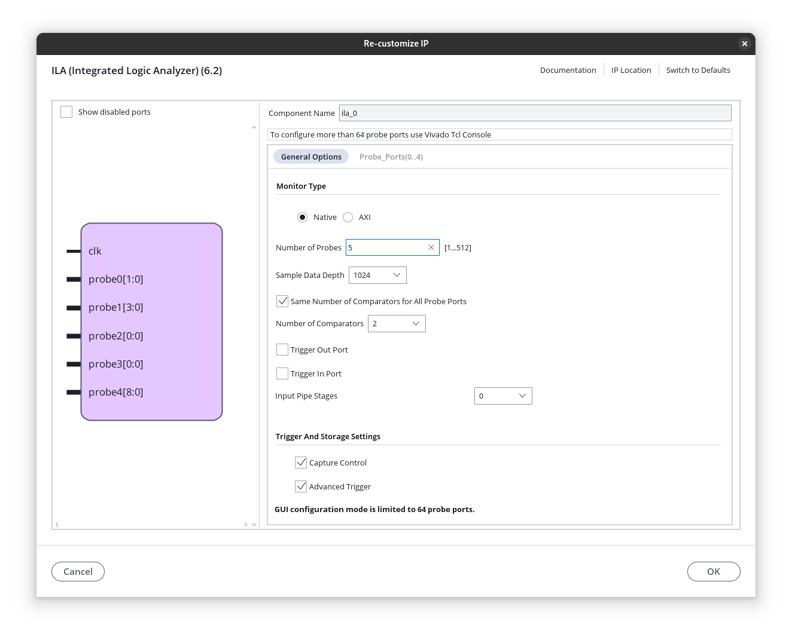
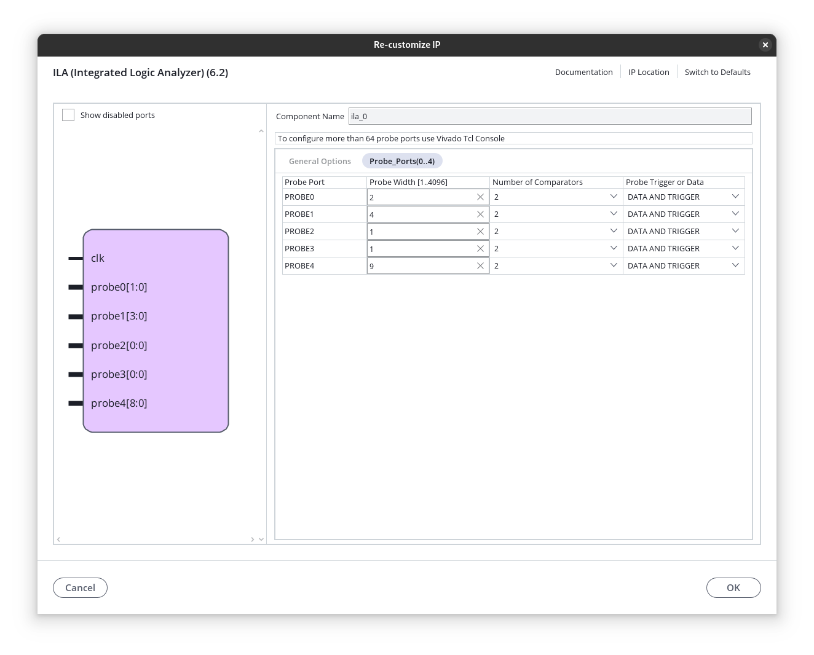
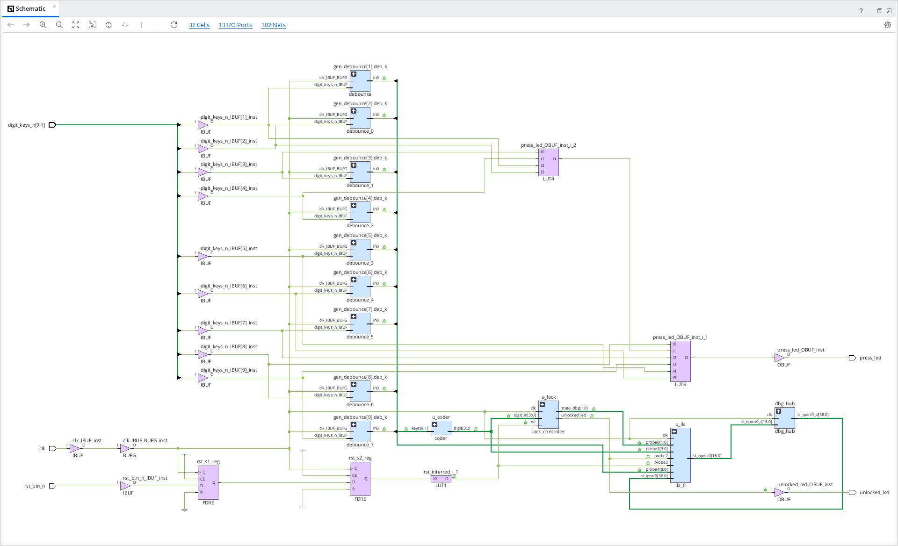
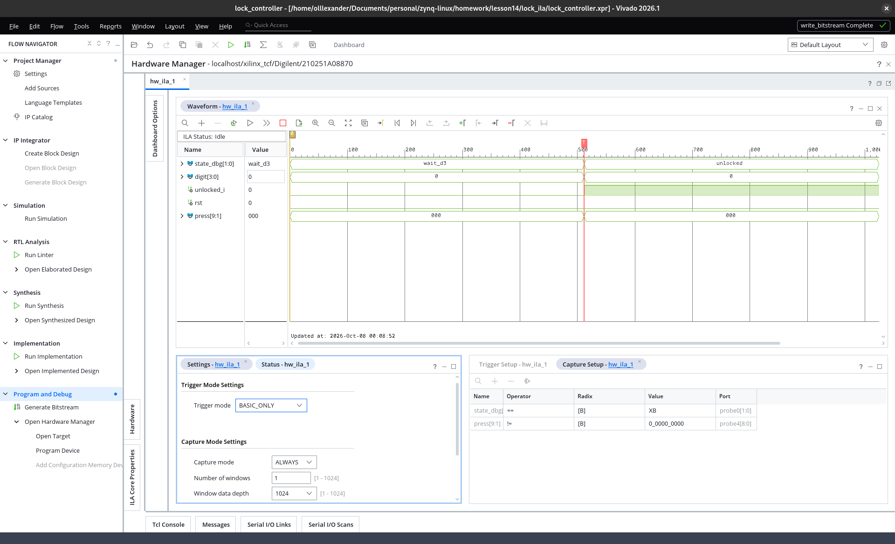
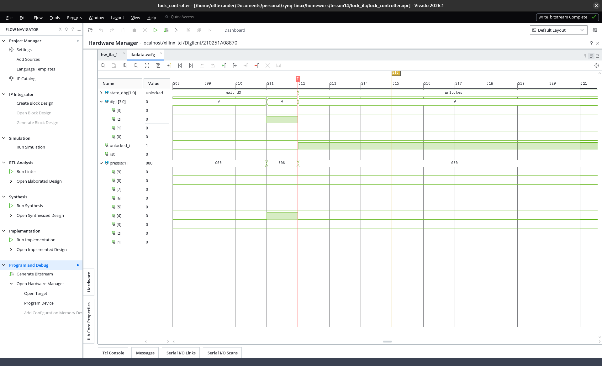
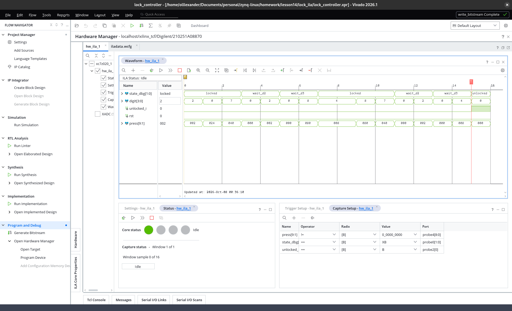

# Звіт — домашнє завдання після лекції 14

**Тема:** ILA — апаратне налагодження в реальному часі: вставка ILA в готовий проєкт, тригер на рідкісну подію, Capture Control, порівняння з симуляцією.
**Інструменти:** Vivado 2026.1 (IP Catalog → ILA, Hardware Manager), JTAG (Digilent-сумісний програматор).
**Плата:** Smart ZYNQ SL (XC7Z020-CLG484). **Варіант А** — на залізі. ILA вставлено **вручну з IP Catalog (HDL Instantiation)** — цей спосіб не залежить від ліцензії/майстра *Set up Debug* і покриває обидва варіанти завдання.

---

## Базовий проєкт

За основу взято кодовий замок із лекції 7 (`lesson7/lock_controller`): FSM `lock_controller`
(код **7 → 2 → 4**, стани `LOCKED → WAIT_D2 → WAIT_D3 → UNLOCKED`, `UNLOCKED` липкий),
`debounce` ×9 (синхронізатор → фільтр стабільності → детектор фронту → **1-тактовий імпульс `press`**),
`coder` (one-hot `press[9:1]` → номер `digit[3:0]`), топ `lock_top`.
Робоча копія — **`lesson14/lock_ila/`**; оригінал lesson7 не змінювався, щоб лишитись «тим самим проєктом» для порівняння (п.5).

Рідкісна подія для тригера обрана природна: **розблокування** — FSM потрапляє в `UNLOCKED` лише після правильної послідовності, один раз за сеанс.

---

## Що додано для ILA

- **`lock_controller.vhd`** — дебаг-порт `state_dbg[1:0]` (`00`=LOCKED, `01`=WAIT_D2, `10`=WAIT_D3, `11`=UNLOCKED): внутрішній стан FSM виведено назовні, бо ILA вручну під'єднується лише до сигналів у своїй області видимості.
- **`ila_0`** з IP Catalog → Debug → ILA, **5 проб** (максимум для Basic):

| Проба | Сигнал | Ширина | Зміст |
|---|---|---|---|
| probe0 | `state_dbg` | 2 | стан FSM |
| probe1 | `digit` | 4 | декодований номер клавіші (1-тактовий імпульс) |
| probe2 | `unlocked_i` | 1 | прапорець розблокування |
| probe3 | `rst` | 1 | скид |
| probe4 | `press` | 9 | one-hot натиснута клавіша після дебаунсу (`press(k)` → біт `k-1`) |

  Опції IP: **Advanced Trigger ☑, Capture Control ☑**, **Number of Comparators = 2** на пробу, Sample Data Depth 1024 (для фінального кадру — 16).




- **`lock_top.vhd`** — інстанціація вручну за шаблоном Vivado:

```vhdl
u_ila : ila_0
    port map (
        clk       => clk,
        probe0    => state_dbg,
        probe1    => digit,
        probe2(0) => unlocked_i,
        probe3(0) => rst,
        probe4    => press
    );
```

- **`conatrains.xdc`** — `create_clock -period 20.000` (реальні 50 МГц на M19; у lesson7 стояв експериментальний період 5 нс, із яким ILA не мала б запасу).
- Тестбенч `lock_controller_ts.vhd` — лише `state_dbg => open`.

---

## Синтез та імплементація

- Synthesis/Implementation без помилок elaboration — ILA реально під'єднана, порти збіглись.
- Таймінг: **WNS = +13.1 нс**, 0 failing endpoints (hold і pulse width теж OK).
- У реалізованому дизайні: **`ila_0` = 1, `dbg_hub` = 1** (Debug Hub вставлено імплементацією, тактується від тих самих 50 МГц). ILA зайняла **1 × RAMB18** (0.36 % BRAM) — 17 біт проб × 1024 семпли.
- Схема реалізованого дизайну: на ній `u_ila`/`ila_0` з `probe0[1:0] … probe4[8:0]`, `dbg_hub`, 9× `gen_debounce`, `u_coder`, `u_lock`.



Bitstream + файл проб `lock_top.ltx` → Program Device → у Hardware Manager з'являється дашборд `hw_ila_1`.

---

## Тригер і Capture Control

**Тригер (basic):** `unlocked_i == R` — **фронт** розблокування (еквівалент `state_dbg == 11`). Це перехід, а не рівень «сигнал=1», і він відбувається рівно раз.


**Capture Control (`BASIC`), умова `OR`:** `state_dbg == XB` (перемкнувся біт 0 — у послідовності `00→01→10→11` він змінюється на кожному кроці) **або** `press != 0` (такт натискання). Семпл пишеться лише на подію — паузи між натисканнями (сотні мс = мільйони тактів) не займають буфер.

---

## Результати на залізі

### 1. Тригер на подію (Capture `ALWAYS`, 1024 семпли)
Вікно 1024 × 20 нс ≈ 20 мкс навколо тригера: `state_dbg` `wait_d3 → unlocked`, `unlocked_i` 0→1 на мітці T.



### 2. Причина → наслідок за один такт (зум 508…521)
Семпл **511**: `digit = 4`, `press = 008` (біт 3 = клавіша 4 — one-hot мапінг підтверджено). Семпл **512 (T)**: `wait_d3 → unlocked`, `unlocked_i` = 1.



У режимі `ALWAYS` попередні натискання «7» і «2» у кадр не потрапляють — вони були за сотні мілісекунд до тригера, а вікно тримає лише 20 мкс.

### 3. Capture Control: уся послідовність в одному вікні (глибина 16)
16 семплів-подій: **невдала спроба** (`2`; подвійне натискання `024` → `digit = 0`; `7-2-8` → відкат у `locked`; стороння `4`, `8`), потім **`7-2-4 → unlocked`** з тригером на 15-му семплі.



Таблиця семплів (із збереженого `lock_ila/iladata.ila`):

| N | state | digit | press | unlocked | подія |
|---|---|---|---|---|---|
| 0 | locked | 2 | 002 | 0 | «2» у LOCKED — ігнорується |
| 1 | locked | 0 | 024 | 0 | дві клавіші одночасно → `coder` дає 0 |
| 2 | locked | 7 | 040 | 0 | «7» |
| 3 | wait_d2 | 0 | 000 | 0 | перехід |
| 4 | wait_d2 | 2 | 002 | 0 | «2» |
| 5 | wait_d3 | 0 | 000 | 0 | перехід |
| 6 | wait_d3 | 8 | 080 | 0 | **«8» — неправильна** |
| 7 | locked | 4 | 008 | 0 | відкат у LOCKED; «4» ігнорується |
| 8–9 | locked | 4, 8 | 008, 080 | 0 | сторонні натискання |
| 10 | locked | 7 | 040 | 0 | «7» |
| 11 | wait_d2 | 0 | 000 | 0 | перехід |
| 12 | wait_d2 | 2 | 002 | 0 | «2» |
| 13 | wait_d3 | 0 | 000 | 0 | перехід |
| 14 | wait_d3 | 4 | 008 | 0 | «4» |
| **15** | **unlocked** | 0 | 000 | **1** | **перехід — TRIGGER** |

---

## Порівняння із симуляцією того самого проєкту (lesson7)

Симуляція FSM із лекції 7 (`lock_controller_ts`, такт TB 10 нс):


Той самий тестбенч перепрогнано на копії з `state_dbg` — усі **9 перевірок PASS** (`T1…T6`), тобто дебаг-порт поведінку не змінив.

| | Симуляція (lesson7) | ILA на залізі (lesson14) |
|---|---|---|
| Послідовність станів | `LOCKED→WAIT_D2→WAIT_D3→UNLOCKED` | та сама (`locked→wait_d2→wait_d3→unlocked`) |
| Момент розблокування | рівно **1 такт** після імпульсу «4» | рівно **1 такт** (семпли 511→512) |
| Форма `digit`/`press` | 1-тактові імпульси (TB / debounce_ts) | 1-тактові імпульси (семпл 511: `008`) |
| Невдала спроба | `7-9-2-4` → на «9» відкат у LOCKED | `7-2-8` → на «8» відкат у `locked` |
| Що між натисканнями | 1 такт (стимул TB) | сотні мс реальних пауз — **стиснуто Capture Control** |
| Чого симуляція не показала | — | подвійне натискання (`press=024` → `digit=0`), яке реальний `coder` коректно відкинув |
| Тактова | 100 МГц (TB) | 50 МГц (M19) |

**Збіг повний** за логікою станів, таймінгом переходу і формою імпульсів. Залізо додатково показало випадок, якого тестбенч не покривав, — одночасне натискання двох клавіш: `coder` видав `0`, FSM не зрушила. Це саме той тип спостереження, заради якого й ставлять ILA: реальний ввід «брудніший» за стимул TB.

---

## Висновок

ILA вставлено в готовий проєкт замка вручну через IP Catalog (5 проб, Advanced Trigger + Capture Control), дизайн синтезовано, реалізовано (WNS +13.1 нс) і прошито на плату. Задано тригер на справжню рідкісну подію — фронт розблокування після коду 7-2-4 (basic-тригер); спрацювання зафіксовано у трьох кадрах: огляд, зум на такт переходу (імпульс «4» → `UNLOCKED` наступним тактом) і стиснутий Capture-Control-кадр з усією послідовністю, включно з невдалою спробою. Порівняння з симуляцією того самого FSM із лекції 7 показало повний збіг станів і таймінгу, а залізо додатково виявило реальний граничний випадок (одночасне натискання), якого тестбенч не моделював.