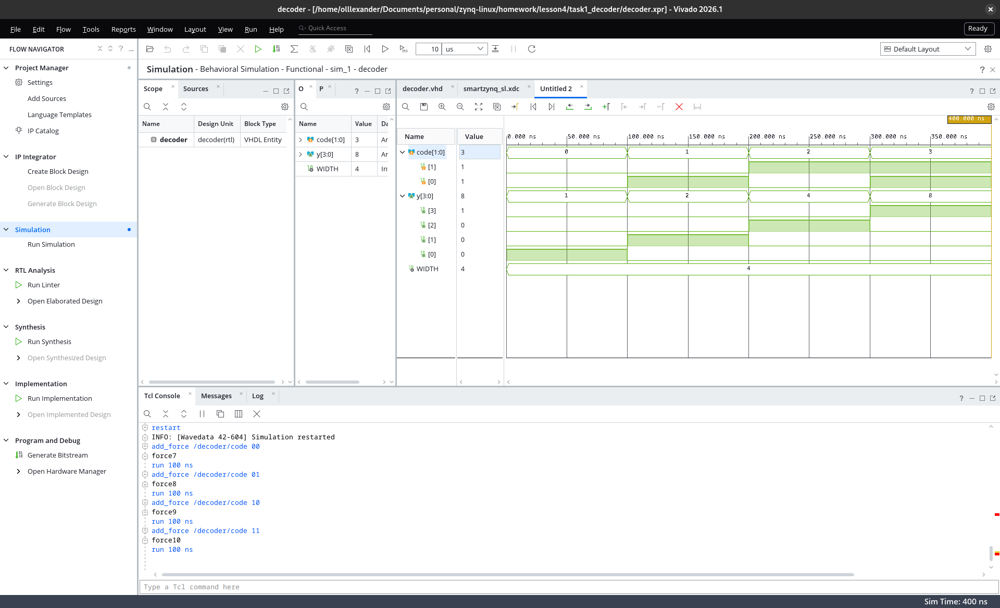
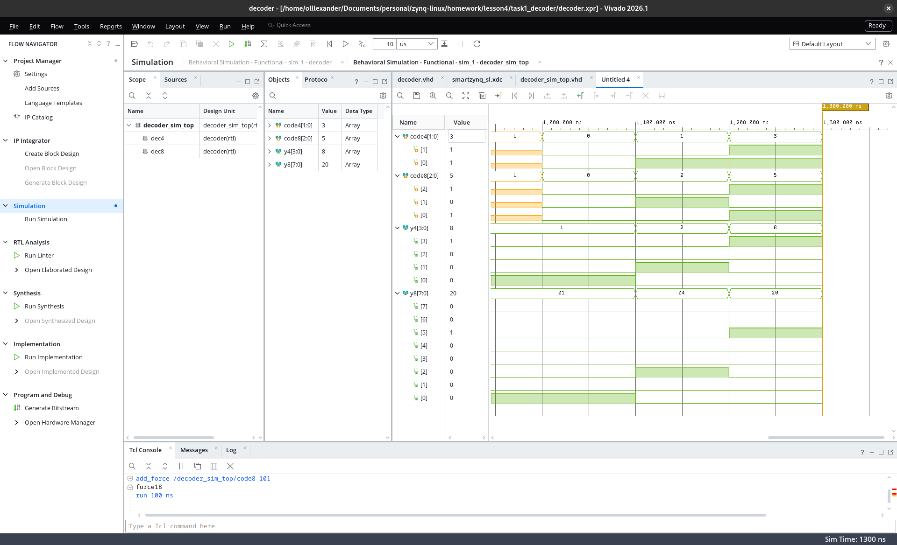
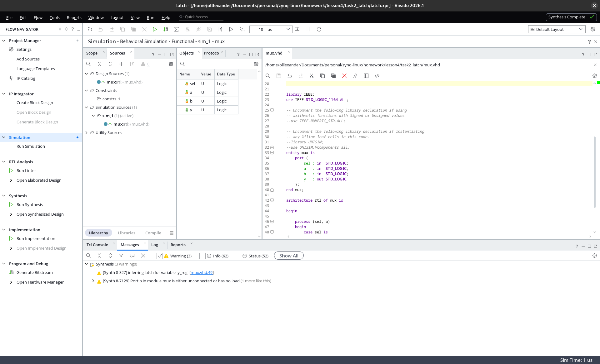
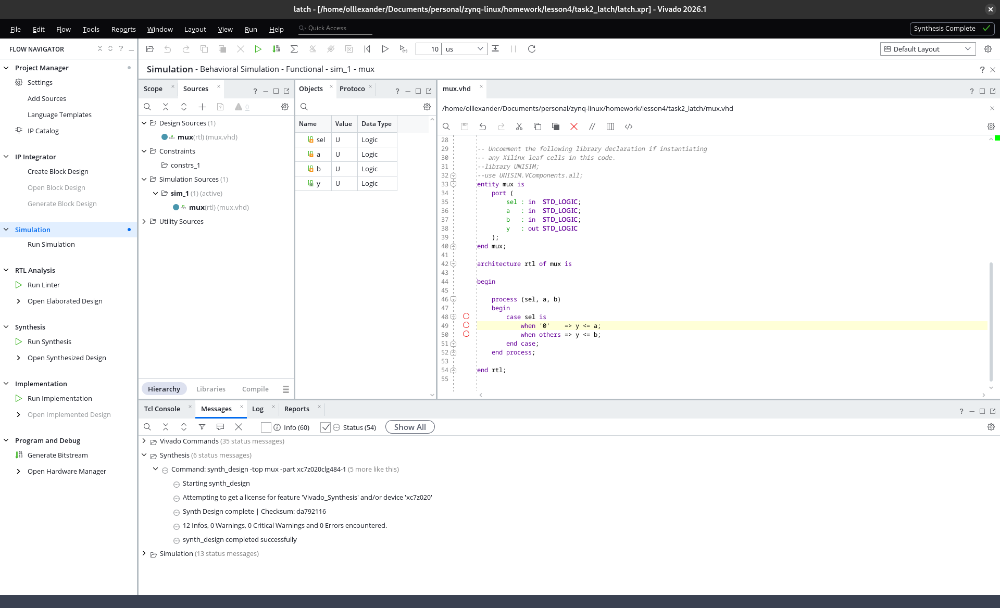
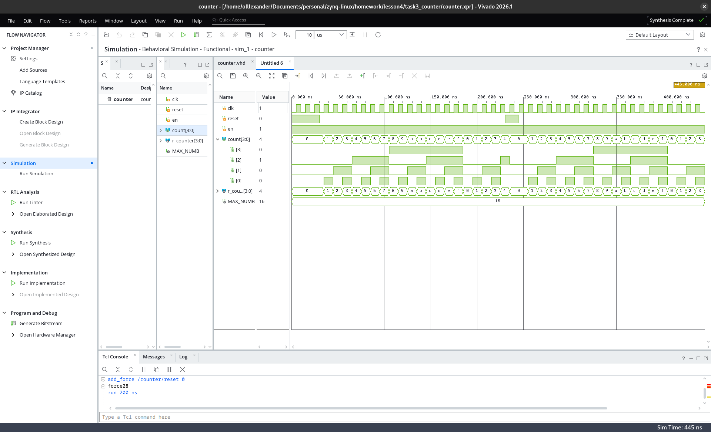

# Звіт — домашнє завдання після заняття 4

Інструменти: Vivado 2026.1, мова — VHDL (2008), симулятор — XSim.
Плата (для прив'язки part): Smart ZYNQ SL, XC7Z020-CLG484-1.
Тестбенчі не використовувались — усі вхідні значення задавалися
в XSim у режимі Force (GUI / команди `add_force` у Tcl Console).

---

## Завдання 1. Параметризований дешифратор

**Файли:** `task1_decoder/decoder.vhd`, `task1_decoder/decoder_sim_top.vhd`
(проєкт: `task1_decoder/decoder.xpr`)

### Модуль

`decoder` — дешифратор «двійковий код → one-hot» з generic-параметром
`WIDTH` (кількість виходів, за замовчуванням 4). Ширина входу не задається
окремо, а обчислюється на етапі компіляції як ⌈log2(WIDTH)⌉
(`IEEE.MATH_REAL`, аналог `$clog2` у Verilog) — параметр один, неузгоджені
комбінації неможливі.

Логіка — комбінаційний процес: спочатку всі виходи скидаються в '0',
потім піднімається розряд з номером, що дорівнює вхідному коду
(`to_integer(unsigned(code))`). Повне присвоєння виходу на початку процесу
гарантує відсутність latch.

### Симуляція одиночного модуля (WIDTH=4)

Вхід `code` форсився послідовно значеннями 00 → 01 → 10 → 11
з кроком 100 нс. На waveform підтверджено: для кожного значення коду
активний рівно один вихід, і саме очікуваний
(`y = 0001 → 0010 → 0100 → 1000`).



### Тестове оточення: два екземпляри з різними WIDTH

`decoder_sim_top` (simulation source, без стимулів) інстанціює той самий
`decoder` двічі: `dec4` з `WIDTH => 4` (вхід 2 біти, вихід 4) та `dec8`
з `WIDTH => 8` (вхід 3 біти, вихід 8). Обидва входи форсились кількома
комбінаціями; обидва екземпляри показали коректний one-hot кожен у своїй
розрядності — один і той самий код модуля працює для обох значень
параметра без жодних змін.



---

## Завдання 2. Ненавмисний latch

**Файли:** `task2_latch/mux.vhd` (проєкт: `task2_latch/latch.xpr`)

### Навмисно неповний опис

Мультиплексор 2-в-1 описано комбінаційним процесом з case, у якому
поведінка задана лише для `sel='0'`. Особливість VHDL: на відміну від
Verilog, тут case зобов'язаний покривати всі значення (без `when others`
код не компілюється), тому «неповноту» створює гілка, що нічого не
присвоює: `when others => null;`. Апаратний зміст той самий: при
`sel='1'` вихід має «тримати» старе значення, а пам'ять у комбінаційній
логіці синтезатор може реалізувати лише засувкою.

Синтез (Vivado) підтвердив це попередженнями:

```
[Synth 8-327]  inferring latch for variable 'y_reg' [mux.vhd:49]
[Synth 8-7129] Port b in module mux is either unconnected or has no load
```

(друге — супутній симптом: у неповному описі вхід `b` взагалі не
використовувався).



### Виправлення

`when others => null;` замінено на `when others => y <= b;` (вихід
отримує значення за будь-якого `sel`), вхід `b` додано до списку
чутливості процесу. Повторний синтез — чистий:
`0 Warnings, 0 Critical Warnings, 0 Errors`; зникли обидва попередження.



---

## Завдання 3. Лічильник з виводом на LED

**Файли:** `task3_counter/counter.srcs/sources_1/new/counter.vhd`
(проєкт: `task3_counter/counter.xpr`)

### Модуль

`counter` — параметризований лічильник за модулем: generic `MAX_NUMB`
(кількість станів, за замовчуванням 16 → рахунок 0..15), ширина виходу
`count` обчислюється як ⌈log2(MAX_NUMB)⌉ на етапі компіляції. Оскільки
`MAX_NUMB` може бути будь-яким додатним числом (не лише степенем двійки),
переповнення реалізоване явним порівнянням: на значенні `MAX_NUMB-1`
наступний стан — 0.

Параметр `MAX_NUMB` введено з прицілом на залізо: модуль планується
зашити у плату Smart ZYNQ SL (XC7Z020), на якій є лише **два**
користувацькі світлодіоди (P20, P21) — там той самий код
інстанціюється з `MAX_NUMB => 4` (2 розряди → 2 LED) без жодних змін
у модулі. За замовчуванням `MAX_NUMB = 16` — рівно 4-бітний лічильник
з умови завдання.

`reset` — синхронний, має найвищий пріоритет. Додатковий вхід `en`
(дозвіл інкременту) зі значенням за замовчуванням '1': непід'єднаний
порт дає поведінку рівно за умовою завдання (інкремент кожного такту);
у платовій версії сюди буде подано імпульс від ланцюжка антибрязкоту
кнопки (K21) — лічильник рахуватиме натискання.

Вихід `count` — прямий двійковий запис поточного значення: кожен розряд
відповідає одному LED.

### Симуляція

`clk` задано force-клоком з періодом 10 нс
(`add_force /counter/clk {0 0ns} {1 5ns} -repeat_every 10ns`),
`reset` — Force Constant. Сценарій: 3 такти reset='1' → рахунок →
повторний reset посеред рахунку.

На waveform підтверджено: рахунок 0→1→…→15 (hex f)→0 з коректним
переповненням; обнулення по reset як зі старту, так і з довільного
значення (на ~230 нс лічильник скинувся зі значення 4); `en`='1' з
default-значення без force. Вектор `count` розгорнуто на окремі розряди:
видно двійковий патерн (розряд 0 перемикається щотакту, розряд 1 — удвічі
рідше і т.д.) — кожен розряд відповідає своєму LED.



### Бонус: запуск на платі (поза вимогами завдання)

Дизайн зашито у плату Smart ZYNQ SL (XC7Z020-CLG484) через JTAG
(Digilent SMT2-сумісний програматор). Топ-модуль `counter_top.vhd`:
той самий `counter` з `MAX_NUMB => 4` (2 розряди → 2 LED на P20/P21),
клок — генератор 50 МГц (M19). Кнопка USER1 (K21) — подія рахунку:
сирий сигнал проходить ланцюжок `debounce.vhd` (синхронізатор 2 FF →
фільтр стабільності 10 мс → детектор переходу 1→0), що дає імпульс
дозволу в один такт — одне натискання = рівно +1 незалежно від
брязкоту і тривалості утримання. Кнопка USER2 (J20) — reset
(синхронізований рівень, інвертований, бо кнопки активно-низькі).
Констрейнти — `smartzynq_sl.xdc` (піни зі схеми плати).

Демонстрація роботи: [task3_board_demo.mp4](screenshots/task3_board_demo.mp4)
