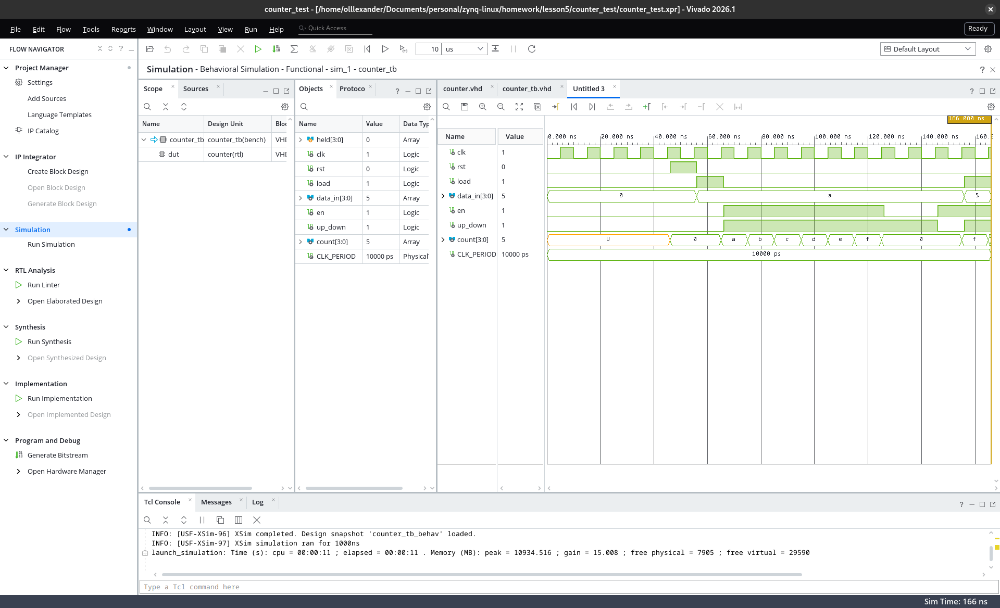

# Звіт — домашнє завдання після заняття 5

**Тема:** верифікація та testbench (лічильник з реверсом і завантаженням).
**Інструменти:** Vivado/XSim 2026.1; мова — **VHDL-2008** (всі
Verilog-конструкції умови замінені прямими VHDL-еквівалентами, див. таблицю).

**Файли:**
- `counter_test/counter.vhd` — DUT
- `counter_test/counter_tb.vhd` — тестбенч
- проєкт: `counter_test/counter_test.xpr`

## Відповідність умови (Verilog) та реалізації (VHDL)

| В умові | У реалізації |
|---|---|
| `reg` / `wire` | `signal` (драйвиться тестбенчем / DUT відповідно) |
| `task automatic check_count(input [3:0] expected, input string name)` | `procedure check_count(expected : in integer; name : in string)` у декларативній частині stim-процесу |
| `$display("PASS/FAIL ...")` | `report ...` — канонічний шлях (з `severity error` у FAIL, тож xsim рахує падіння); побуквенний аналог `$display` існує (`std.textio` + `writeline(output, ...)`), але свідомо не використаний, щоб не втрачати severity |
| `===` (X-чутливе порівняння) | звичайне `=` — у VHDL воно порівнює значення U/X буквально, спецоператор не потрібен |
| `@(posedge clk); #1;` | `wait_cycles(n)`: n × `wait until rising_edge(clk)` + `wait for 1 ns` (пауза «встоятися» — одна, перед читанням) |
| X до першого reset | `U` (uninitialized) — див. пункт 9 |
| `$finish` | `std.env.finish` (VHDL-2008) |

## Пункт 1. Модуль counter

Імена і розрядності портів — точно за умовою (`clk`, `rst`, `load`,
`data_in[3:0]`, `en`, `up_down`, `count[3:0]`).

- **Асинхронний reset:** `rst` у списку чутливості процесу, перевірка до
  `rising_edge(clk)` — скидання діє миттєво, не чекаючи фронту.
- **Пріоритет умов** читається структурою if/elsif зверху вниз:
  rst > load > en > утримання (нема присвоєння всередині `rising_edge` —
  тригери тримають значення; latch це не породжує).
- **Wrap природний:** 4-бітний `unsigned`: 15+1=0, 0−1=15.
- Внутрішній регістр навмисно **без ініціалізатора** — інакше в пункті 9
  не було б чого показувати.

## Пункти 2-8. Тестбенч

- Генератор клоку 100 МГц — конкурентне присвоєння
  `clk <= not clk after CLK_PERIOD / 2;` (ініціалізатор `clk := '0'`
  обов'язковий: `not 'U' = 'U'`).
- Один послідовний stim-процес: сценарій — одна нитка, один драйвер на
  кожен сигнал (два стимул-процеси дали б резолвлення і 'X').
- Допоміжні підпрограми в декларативній частині процесу:
  `wait_cycles(n)` — такти окремо від перевірок (як вимагає п.8), і
  `check_count(expected, name)` — єдине місце порівняння та PASS/FAIL-звіту.
- Перевірка п.5 (утримання) зроблена сильнішою за умову: знімок `count`
  у змінну (constant-in параметр процедури) до паузи і порівняння після —
  перевіряється властивість «значення не змінилося», а не константа.

## Сценарій тестування

| Крок | Дія | Очікування | Час у логу |
|---|---|---|---|
| п.9 | 2 такти без reset | `count = UUUU` | 0–20 нс |
| п.3 | reset; load 10 | 10 | 66 нс |
| п.4 | en=1, up_down=1, 3 такти | 13 | 96 нс |
| п.4 | ще 3 такти | 0 (wrap 15 → 0) | 126 нс |
| п.5 | en=0, 2 такти | без змін (знімок) | 146 нс |
| п.6 | en=1, up_down=0, 1 такт | 15 (wrap 0 → 15) | 156 нс |
| п.7 | load=1 (data=5) **і** en=1 одночасно, 1 такт | 5 — пріоритет load | 166 нс |
| бонус | load=0, up_down=0, 2 такти | 3 (5 → 3, без wrap) | 186 нс |

## Пункт 9. Невизначений стан до reset

До моменту reset на `count` видно `U` (uninitialized): внутрішній регістр
лічильника оголошений без початкового значення, і жодне присвоєння йому ще
не відбулося — симулятор чесно позначає «ніколи не записаний» стан, а не
підставляє нуль; перше присвоєння в житті регістра — асинхронний reset,
після якого рахунок починається з 0.

Відмінність від умови (там очікується X): у Verilog на цьому місці був би
`X`, бо мова не розрізняє «не ініціалізовано» і «конфлікт драйверів»; VHDL
має для цього окремі значення `U` та `X`. Саме тому Verilog-тестбенчам
потрібне спеціальне порівняння `===`, тоді як у VHDL звичайне `=` порівнює
ці стани чесно.



## Пункт 10. Консольний прогін

```
xvhdl --2008 counter.vhd counter_tb.vhd
xelab counter_tb -s tb_sim
xsim tb_sim -R
```

Всі 7 перевірок PASS (6 з умови + бонус), завершення через
`std.env.finish`. Повний вивід прогону (абсолютні шляхи скорочено до
імен файлів):

```
****** xsim v2026.1 (64-bit)
  **** SW Build 6511674 on Tue Jun 16 11:01:26 MDT 2026
  **** Start of session at: Sun Sep  6 22:29:53 2026

source xsim.dir/tb_sim/xsim_script.tcl
# xsim {tb_sim} -autoloadwcfg -runall
Time resolution is 1 ps
run -all
Note: PASS: load 10
Time: 66 ns  Iteration: 0  Process: /counter_tb/stim  File: counter_tb.vhd
Note: PASS: count up 10 -> 13
Time: 96 ns  Iteration: 0  Process: /counter_tb/stim  File: counter_tb.vhd
Note: PASS: count up wrap 15 -> 0
Time: 126 ns  Iteration: 0  Process: /counter_tb/stim  File: counter_tb.vhd
Note: PASS: hold with en=0
Time: 146 ns  Iteration: 0  Process: /counter_tb/stim  File: counter_tb.vhd
Note: PASS: count down wrap 0 -> 15
Time: 156 ns  Iteration: 0  Process: /counter_tb/stim  File: counter_tb.vhd
Note: PASS: load priority over en
Time: 166 ns  Iteration: 0  Process: /counter_tb/stim  File: counter_tb.vhd
Note: PASS: bonus: count down 5 -> 3, no wrap
Time: 186 ns  Iteration: 0  Process: /counter_tb/stim  File: counter_tb.vhd
Note: SIMULATION DONE
Time: 186 ns  Iteration: 0  Process: /counter_tb/stim  File: counter_tb.vhd
$finish called at time : 186 ns
exit
INFO: xsimkernel Simulation Memory Usage: 151752 KB (Peak: 209088 KB), Simulation CPU Usage: 1800 ms
INFO: [Common 17-206] Exiting xsim at Sun Sep  6 22:29:58 2026...
```

Примітка: рядки `Time/Iteration/Process/File` після кожного повідомлення —
формат виводу VHDL `report` у xsim (Verilog `$display` друкує без них);
метадані часу підтверджують послідовність перевірок у модельному часі.

## Бонус

Виконано: після п.7 (лічильник на 5) знято `load`, `up_down='0'`, два такти
вниз — очікування 3 (5 → 4 → 3). Перевіряється «звичайний», не крайовий
рахунок униз без переходу через межу; значення 5 отримане природним
продовженням сценарію (воно відмінне від 0 і 15, тож окреме завантаження 8
з прикладу умови не знадобилося).

Результат у логу:

```
Note: PASS: bonus: count down 5 -> 3, no wrap
Time: 186 ns  Iteration: 0  Process: /counter_tb/stim  File: counter_tb.vhd
```
