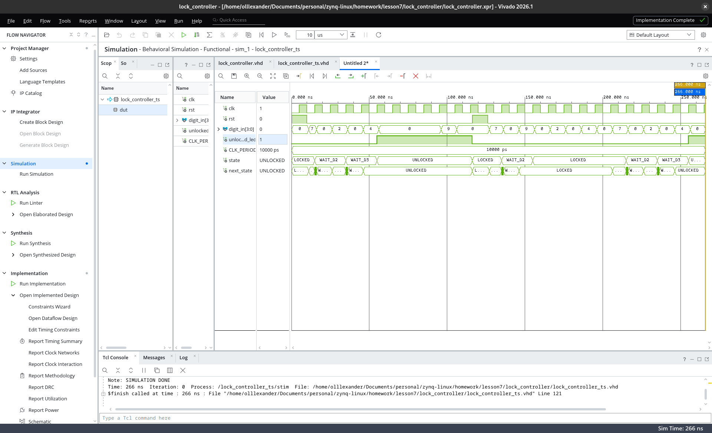
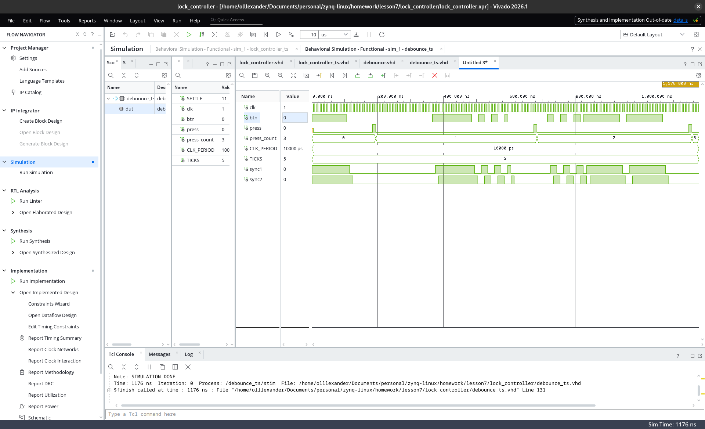
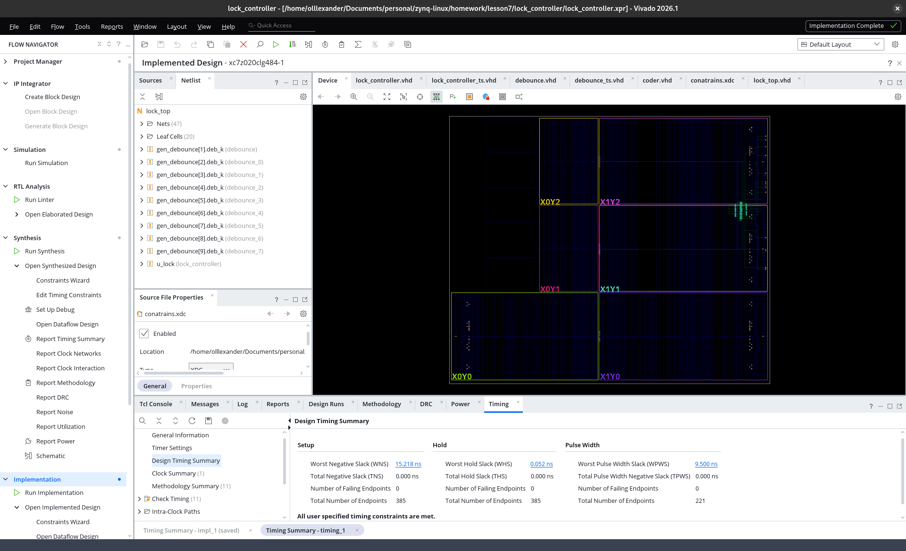
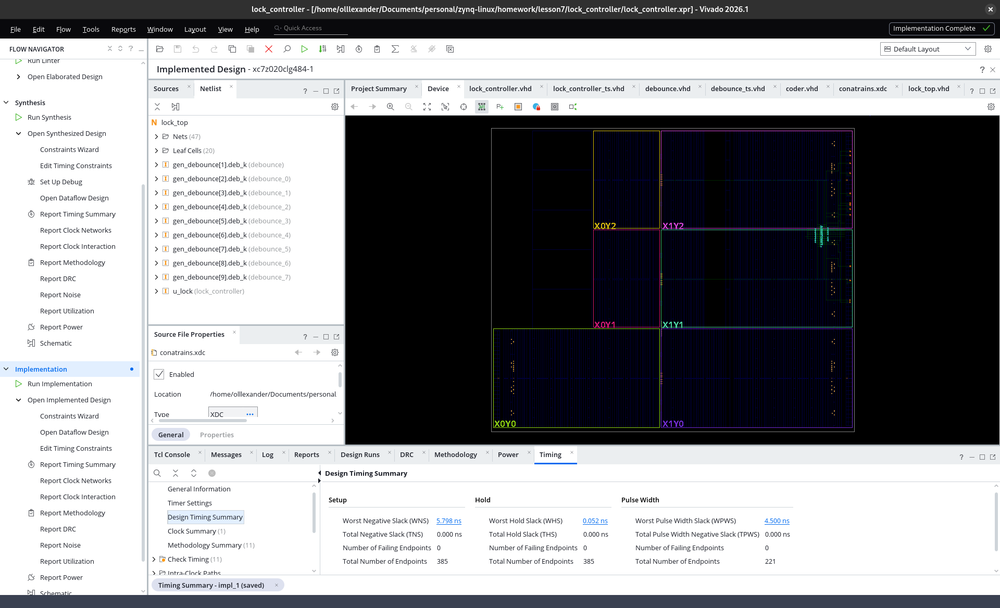
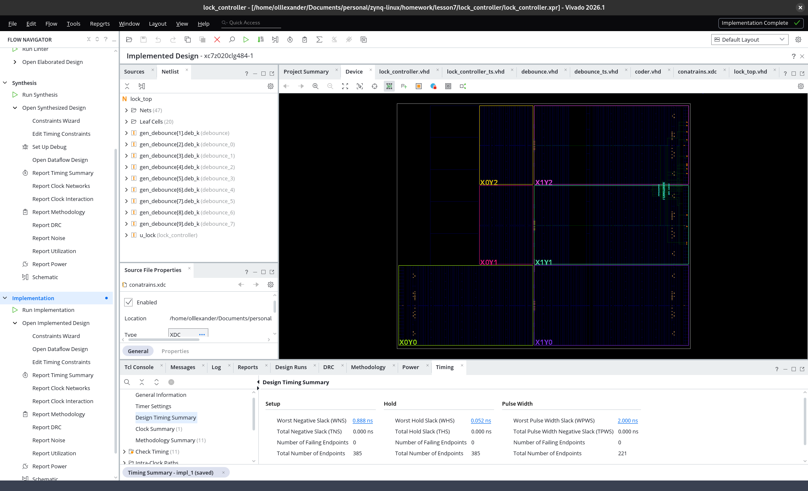
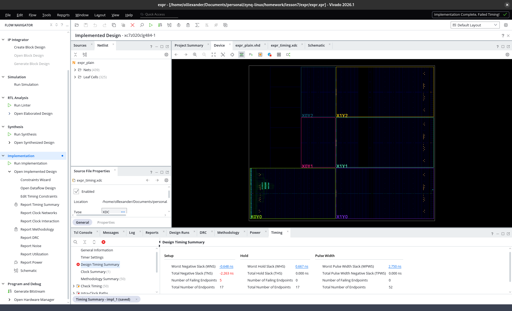
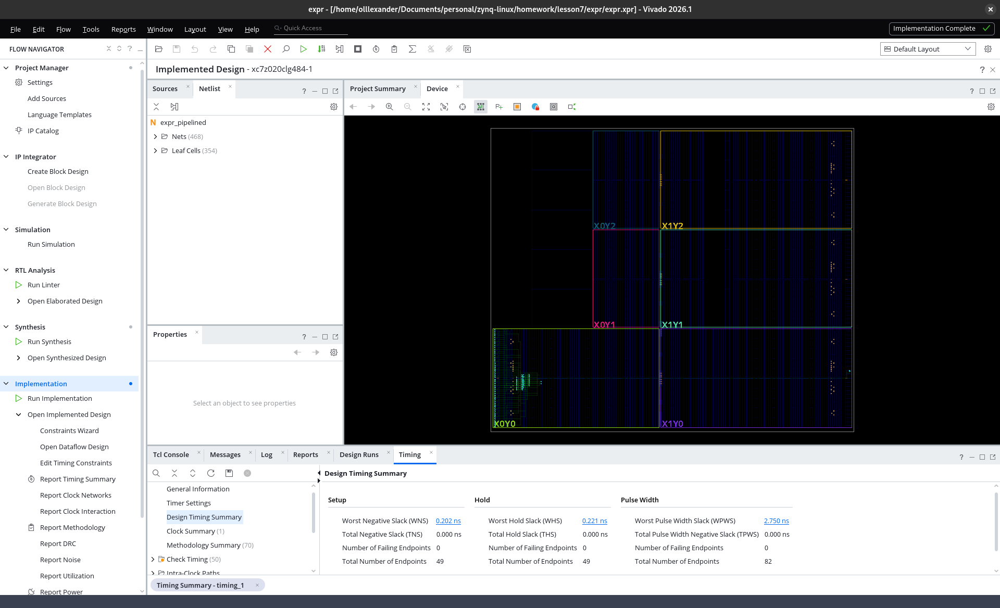

# Звіт — домашнє завдання після занять 6-7

**Інструменти:** Vivado/XSim 2026.1; мова — **VHDL-2008**
(Verilog-конструкції умови замінені прямими VHDL-еквівалентами;
three-process pattern реалізовано трьома процесами).
**Плата:** Smart ZYNQ SL rev 1.3B (XC7Z020-CLG484-1).

---

## Частина 1. Контролер кодового замка

**Файли** (`lock_controller/`):
- `lock_controller.vhd` — FSM (модуль за умовою, порти без змін)
- `lock_controller_ts.vhd` — тестбенч FSM
- `debounce.vhd` — фільтр кнопки (п.1.3)
- `debounce_ts.vhd` — тестбенч debounce
- `coder.vhd` — енкодер 9 кнопок → BCD-цифра
- `lock_top.vhd` — топ-модуль для плати
- `conatrains.xdc` — констрейнти (піни, pull-up, тактування)

### 1.1. Модуль lock_controller

Код замка: **7 → 2 → 4**. Стани `LOCKED, WAIT_D2, WAIT_D3, UNLOCKED` —
перелічуваний тип (на waveform видно іменами). Порти точно за умовою:
`clk`, `rst` (асинхронний, активний '1'), `digit_in[3:0]`, `unlocked_led`.

**Three-process pattern** — три процеси, кожен з однією відповідальністю:
1. `state_reg` — лише регістр стану (async reset → LOCKED, фронт →
   `state <= next_state`);
2. `next_state_logic` — лише переходи: комбінаційний `case` по стану,
   з дефолтом `next_state <= state` на початку (захист від latch);
3. `output_logic` — лише вихід (Moore): `unlocked_led = '1'` тільки
   в UNLOCKED.

Проєктне рішення: `digit_in = "0000"` трактується як «цифра не
вводиться» (нейтральний стан шини між натисканнями) — автомат стоїть
на місці; будь-яка ненульова цифра, крім очікуваної, повертає в LOCKED.
Без нейтралі автомат, що реагує кожен такт, фізично несумісний із
кнопковим вводом (між натисканнями завжди є пауза). UNLOCKED липкий,
вихід лише через rst — за умовою.

### 1.2. Тестбенч FSM

Профіль вводу відтворює реальні кнопки: процедура `press(d)` подає
цифру на один такт і повертає шину в нейтраль. Шість тестів (9 перевірок):

| Тест | Сценарій | Очікування |
|---|---|---|
| T1 | reset | led=0 |
| T2 | 7 → 2 → 4 (з паузами) | led=0 після 1-ї та 2-ї цифри, led=1 після 3-ї |
| T3 | час + зайва цифра в UNLOCKED | led тримається (липкий) |
| T4 | reset з UNLOCKED | led=0 |
| T5 | 7 → 9(помилка) → 2 → 4 | led=0 — помилка скидає в LOCKED, «хвіст» коду не відкриває |
| T6 | повний код після невдалої спроби | led=1 — автомат відновлюваний |

```
Note: PASS: T1: locked after reset
Note: PASS: T2a: still locked after 1st digit
Note: PASS: T2b: still locked after 2nd digit
Note: PASS: T2c: unlocked after full code 7-2-4
Note: PASS: T3a: stays unlocked over time
Note: PASS: T3b: stays unlocked after extra digit
Note: PASS: T4: locked again after reset
Note: PASS: T5: wrong 2nd digit resets to LOCKED
Note: PASS: T6: full code works after failed attempt
Note: SIMULATION DONE
$finish called at time : 266 ns
```

Waveform (стани — іменами enum-типу; видно всі переходи
LOCKED→WAIT_D2→WAIT_D3→UNLOCKED, скидання і помилковий набір):



### 1.3. Debounce

`debounce.vhd` — обробка однієї кнопки (активно-низької), теж три
процеси за відповідальностями: синхронізатор (2 тригери, захист від
метастабільності) → фільтр стабільності (новий рівень приймається після
`STABLE_TICKS` тактів незмінності; 10 мс @ 50 МГц) → детектор
натискання (перехід 1→0 дає `press` рівно на один такт — утримання
кнопки не флудить цифрами, довільно довге натискання = одна подія).

Тестбенч рахує press-імпульси окремим процесом-монітором; 7 тестів:
чисте натискання = 1 імпульс, утримання/відпускання = 0 додаткових,
натискання і відпускання з брязкотом = усе одно рівно 1/0, короткий
глітч (коротший за поріг) відкинутий, наступне натискання чесно +1.

```
Note: PASS: T1: clean press -> one pulse
Note: PASS: T2: holding adds no pulses
Note: PASS: T3: release adds no pulses
Note: PASS: T4: bouncy press -> exactly one pulse
Note: PASS: T5: bouncy release adds no pulses
Note: PASS: T6: short glitch rejected
Note: PASS: T7: next real press counted
Note: SIMULATION DONE
$finish called at time : 1176 ns
```



### 1.4. Понад умову: повний тракт вводу і перевірка на платі

Щоб замок працював як пристрій, а не лише в симуляції, зібрано повний
тракт вводу (`lock_top.vhd`):

```
9 тактових кнопок (цифри 1..9, J5, активно-низькі, внутрішні pull-up)
  → 9 × debounce (for-generate)
  → coder: рівно одна натиснута → її номер на 1 такт, інакше "0000"
    (нуль кнопок або акорд = нейтраль; енкодер не «вигадує» цифру)
  → digit_in незміненого lock_controller
```

KEY1 плати = reset (синхронізований рівень, інверсія — кнопка
активно-низька). LED1 (P20) — індикація утримання будь-якої кнопки
(від сирих пінів — заразом тест проводки), LED2 (P21) = `unlocked_led`.
У констрейнтах — піни J5 (H19, E18, F17, C17, G19, E20, D22, B22, B17;
A17 у резерві), `PULLUP true` на кожен вхід кнопки,
`create_clock` 20 нс на M19.

**Перевірено на залізі:** дизайн зашито в плату через JTAG; введення
коду 7-2-4 з тактових кнопок відкриває замок (LED2), неправильні
послідовності — ні, UNLOCKED тримається до скидання KEY1, LED1
підтверджує кожне натискання. Все працює відповідно до симуляції.

---

## Частина 2. Аналіз Timing Summary

Замість лекційного alu.v використано власний дизайн з частини 1 —
**lock_top**: він відповідає ключовій вимозі умови «входи реєстрові»
за побудовою (кожна кнопка першою ж дією потрапляє у тригери
синхронізатора debounce, reset — у власний синхронізатор), тому всі
шляхи в дизайні — «регістр → регістр» і WNS є реальним числом.
Комбінаційна глибина є: 19-бітові компаратори фільтрів стабільності,
енкодер 9→BCD, логіка переходів FSM.

Тактовий констрейнт — один рядок у .xdc (за умовою):

```tcl
create_clock -period <період> -name sys_clk [get_ports clk]
```

Проведено експеримент з трьома значеннями періоду; для кожного
пройдено повний маршрут **Run Implementation** (скріншоти — з
Implemented Design). Для порівняння наведені й оцінки після синтезу:

| Період | WNS після синтезу (оцінка) | WNS після імплементації | Крит. шлях (impl) = період − WNS |
|---|---|---|---|
| 20 нс (50 МГц) | 15.642 нс | **15.218 нс** | 4.782 нс |
| 10 нс (100 МГц) | 5.642 нс | **5.798 нс** | 4.202 нс |
| 5 нс (200 МГц) | 0.642 нс | **0.888 нс** | 4.112 нс |

**Висновки з експерименту:**

1. WNS — не властивість схеми, а запас між схемою і вимогою: він
   зменшується приблизно на стільки, на скільки стискається період.
2. Після синтезу «критичний шлях» був константою (4.358 нс) — це
   оцінка з приблизними затримками розводки. Після імплементації він
   різний для різних періодів (4.78 → 4.20 → 4.11 нс): place&route
   працює з адаптивним зусиллям і оптимізує розкладку тим щільніше,
   чим жорсткіший констрейнт.
3. Дизайн вкладається навіть у 5 нс (WNS = +0.888) — запас по частоті
   до ~240 МГц. Подальше стискання зробило б WNS негативним, що
   навмисно демонструється у частині 3.





---

## Частина 3. Неконвеєризований і конвеєризований варіант

**Власний варіант** (не файли з прикладу): вираз **(a·b) + (c·d)**,
операнди 8-бітні. Файли: `expr/expr_plain.vhd`, `expr/expr_pipelined.vhd`,
`expr/expr_timing.xdc` (проєкт: `expr/expr.xpr`).

Обидва модулі мають **реєстрові входи** (a_reg..d_reg, Stage 0) — всі шляхи «регістр → регістр», однорядкового
`create_clock` достатньо, Unconstrained Paths відсутні. Ширини
пораховані без мовчазного зрізання: 8×8 = 16 біт на добуток,
16+16 → 17 біт результату.

- `expr_plain`: весь вираз (два множення + 17-бітове додавання)
  одним комбінаційним шляхом між Stage 0 і вихідним регістром.
- `expr_pipelined`: той самий вираз з одним конвеєрним зрізом —
  добутки реєструються (p_ab, p_cd), додавання виконується наступним
  тактом. Обидва операнди суми народжуються в одну стадію, тож
  додаткового вирівнювання даних (аналог d_stage з прикладу) не
  потрібно. Ціна: латентність 3 такти замість 2; пропускна здатність
  не змінилася — результат щотакту.

Період підібраний експериментально: **6.5 нс** (153.8 МГц), однаковий
для обох прогонів; обидва результати — після Run Implementation.

| Дизайн | WNS @ 6.5 нс | Критичний шлях | Таймінг |
|---|---|---|---|
| expr_plain | **−0.648 нс** (TNS −2.263, 5 failing) | 7.148 нс | **провалений** |
| expr_pipelined | **+0.202 нс** (0 failing) | 6.298 нс | виконаний |

### Чому змінився WNS

WNS визначається **найдовшим одиничним шляхом «регістр → регістр»**,
бо саме за один такт сигнал мусить пройти від тригера до тригера.

У `expr_plain` між регістрами лежить увесь вираз: множення (16-бітний
добуток) і слідом 17-бітове додавання — сумарно ~7.15 нс логіки та
розводки, що більше за період 6.5 нс, звідси WNS = −0.648 нс.

Конвеєрний регістр у `expr_pipelined` розрізає цей шлях на два
коротші, кожен з яких перевіряється таймінг-аналізом **окремо**:
«множення → регістр добутку» і «регістр добутку → додавання →
вихідний регістр». Найгіршим лишився шлях множення (~6.30 нс), і він
уже вкладається в період — WNS став позитивним (+0.202 нс). Додавання
Stage 2 має великий запас.

Додатковий ефект: регістр одразу після множника дозволяє інструменту
втягнути його всередину DSP48-блока (внутрішній конвеєрний регістр
DSP), що додатково скорочує шлях порівняно з «голим» комбінаційним
множенням.

Підсумок: конвеєризація не «прискорює обчислення» одного значення
(латентність навіть зросла на такт) — вона скорочує найгірший шлях,
дозволяючи підняти тактову частоту; пропускна здатність при цьому
зберігається (новий результат кожного такту).



